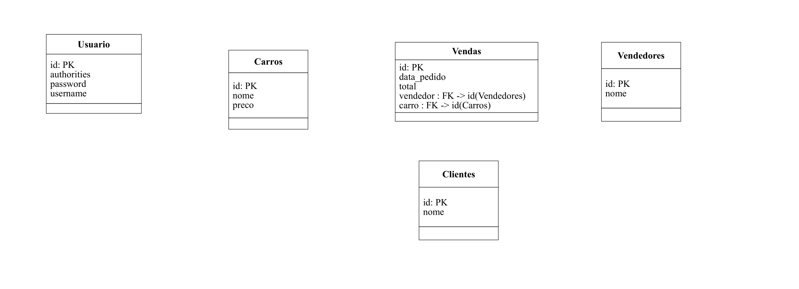

# SpringBoot_Learn
Projeto simples para praticar Spring

Pré-finalizado

O objetivo desse projeto é única e exclusivamente aprendizado.

Esse projeto já é uma API REST. Para sua contrução, segui alguns cursos tanto teóricos como práticos.
É uma estrutura back-end construída totalmente utilizando Spring. Utilizei também algumas ferramentas, que também
puderam somar no meu aprendizado, como por exemplo o Lombok.

Diagrama do banco. Sem marcações de relações:

Em breve, em outro projeto, pretendo criar também o front-end em React. (Full stack)

